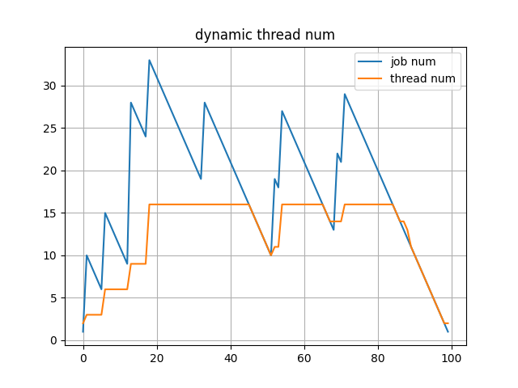

## A thread pool in C

Current implement:
- Fix thread mode
- Dynamic thead mode
  - Automatic increase and decrease of threads according to the number of tasks
  - Set Job_Worker_Ratio to control the thread adjustment range
  - Set Time_Interval to prevent jitter in the number of threads
- Lazy creation of threads
- Unlimited job queue size

## C 语言线程库

已实现以下功能：
- 固定线程数量模式，可以任意调节线程增减
- 自动线程模式，
  - 根据任务数量，自动增减线程。
  - 设置任务线程数量比，控制线程调整幅度
  - 设置线程调节间隔，防止线程数量抖动
- 延迟线程创建
- 无限任务队列

下图为自动模式下，线程数量和任务数量的关系图：
前提条件是
- 最大线程数量为16
- 最小线程数量为2

